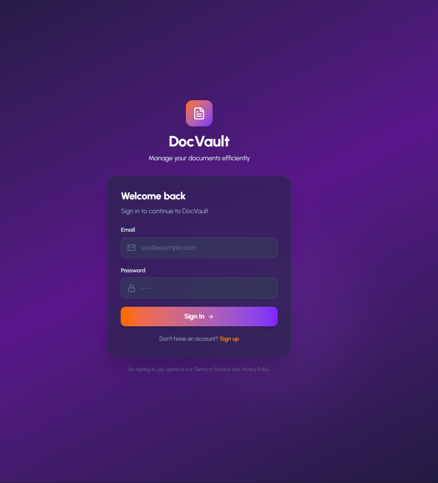
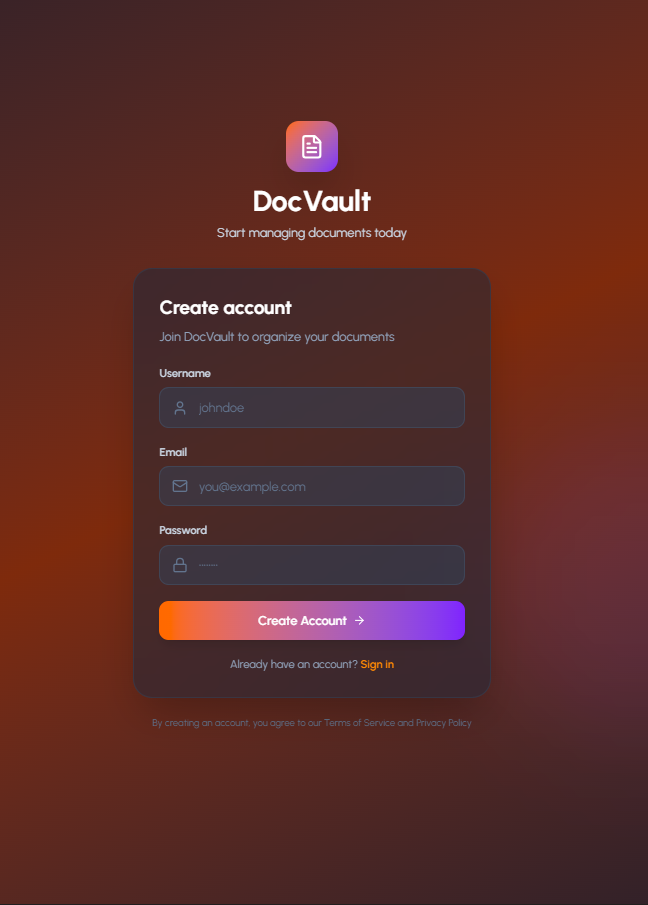
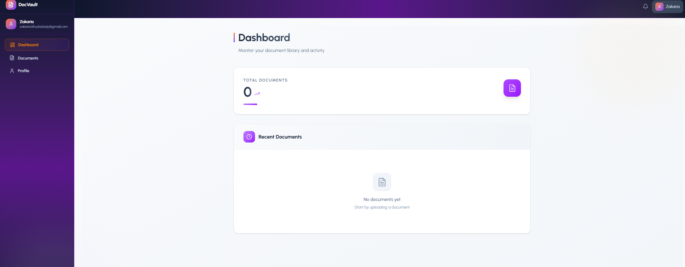
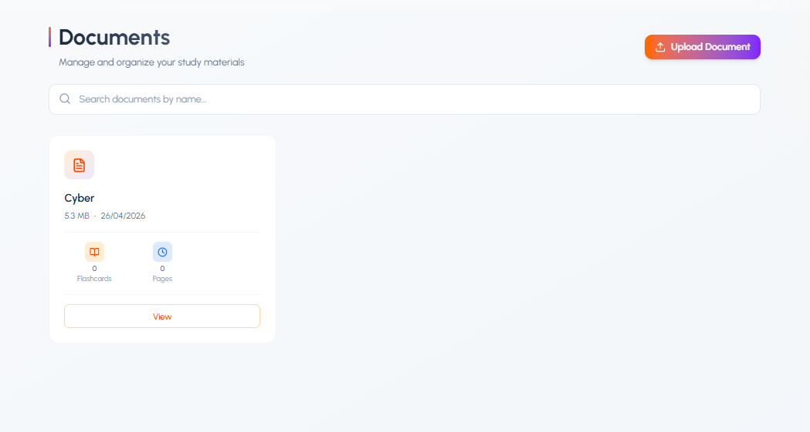
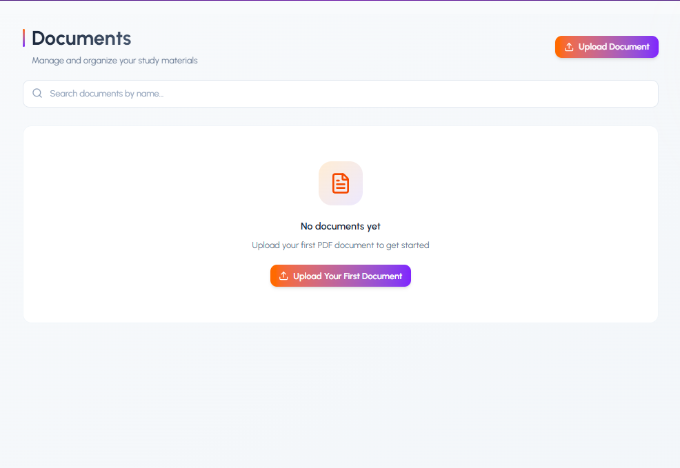
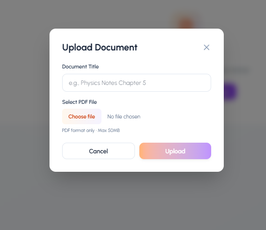
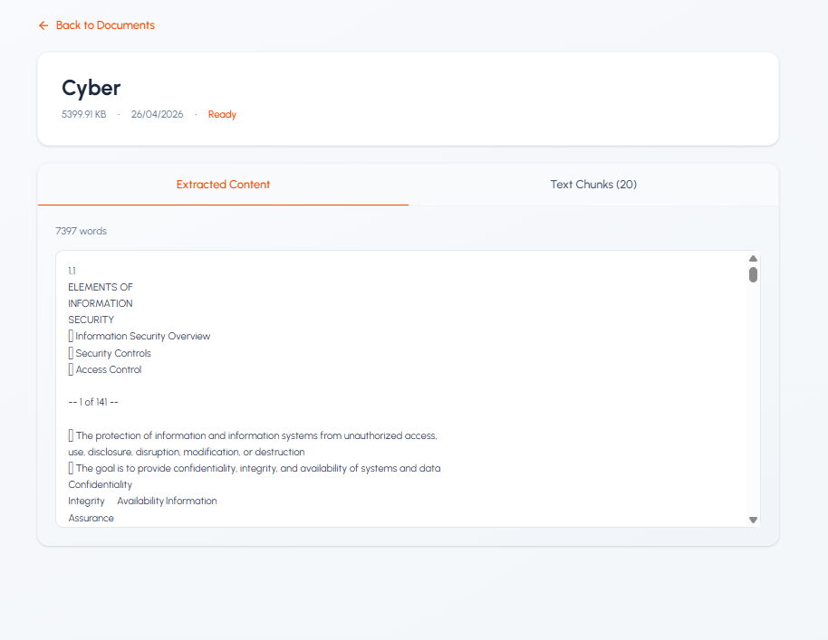
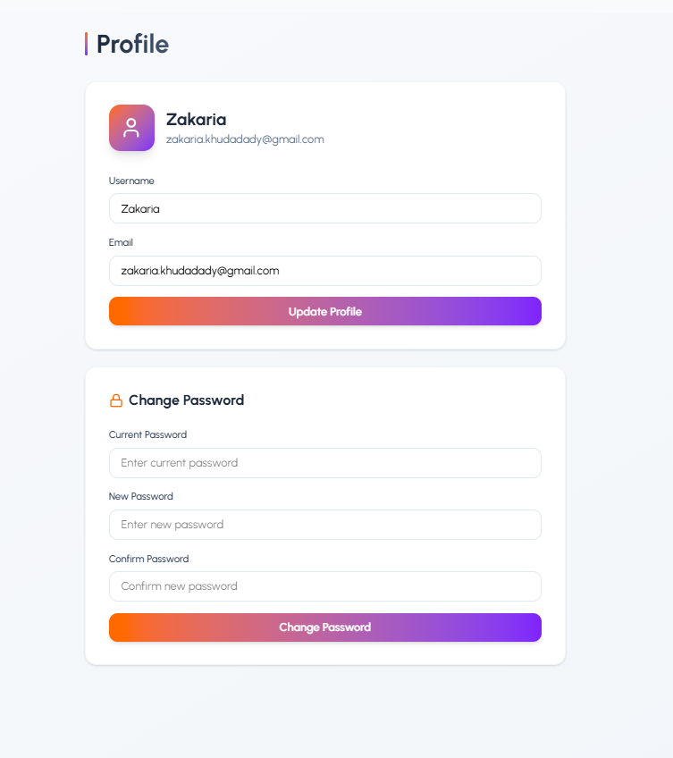
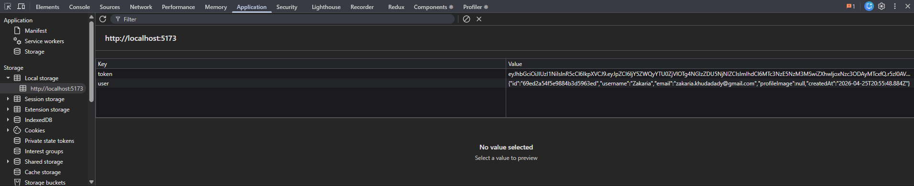

# DocVault — Document Management System

A full-stack document management application where users can securely upload, view, and delete documents. Built with React and Node.js, protected with JWT authentication.

## Live Demo

> [Coming soon — deploying to AWS EC2]

---

## Preview

### Login Page
Secure login with JWT authentication. Passwords are hashed using bcrypt and never stored in plain text.



---

### Register Page
Create a new account to get started with DocVault.



---

### Dashboard
Overview of your document library with total document count and recent activity.



---

### Documents
Browse and manage all your uploaded documents in one place.



---

### Upload Documents
Upload documents directly from the app with a clean interface.



---

### Upload Popup
A modal popup for selecting and confirming document uploads.



---

### Document View
View your document content directly inside the app.



---

### Profile Page
Update your account details and profile information.



---

### Secure Authentication
JWT token and user data stored securely in localStorage — passwords are never cached.



---

## Features

- User registration and login
- JWT authentication with secure token storage
- Password hashing with bcrypt
- Upload documents
- View documents
- Delete documents
- Update profile information
- Logout
- Responsive UI with Tailwind CSS
- Toast notifications for user feedback

---

## Tech Stack

| Layer | Technology |
|---|---|
| Frontend | React 19, Vite |
| Styling | Tailwind CSS |
| Routing | React Router DOM v7 |
| HTTP Client | Axios |
| Icons | Lucide React |
| Backend | Node.js, Express 5 |
| Database | MongoDB, Mongoose |
| Authentication | JWT, Bcrypt |
| File Uploads | Multer |
| Validation | express-validator |

---

## Project Structure

```
DocVault/
├── frontend/
│   ├── src/
│   │   ├── components/
│   │   ├── pages/
│   │   ├── context/
│   │   ├── services/
│   │   └── utils/
│   ├── screenshots/
│   └── vite.config.js
├── backend/
│   ├── config/
│   ├── controllers/
│   ├── middleware/
│   ├── models/
│   ├── routes/
│   ├── uploads/
│   ├── utils/
│   └── server.js
```

---

## Getting Started

### Prerequisites

- Node.js v18+
- MongoDB (local or MongoDB Atlas)

### Backend Setup

```bash
cd backend
npm install
```

Create a `.env` file in the backend folder:

```env
MONGODB_URI=your_mongodb_connection_string
JWT_SECRET=your_jwt_secret
PORT=5000
FRONTEND_URL=http://localhost:5173
```

```bash
npm run dev
```

### Frontend Setup

```bash
cd frontend
npm install
npm run dev
```

Visit `http://localhost:5173`

---

## Security

- Passwords hashed with **bcrypt** — never stored in plain text
- **JWT tokens** used for stateless authentication
- Protected routes on both frontend and backend
- Input validation with **express-validator**

---

## Deployment

This project is deployed using a full CI/CD pipeline:

- **Docker** — containerized frontend and backend
- **Jenkins** — automated build, test, and deploy on every git push
- **AWS EC2** — hosted on a Linux server

Every `git push` to `main` automatically builds and deploys the latest version.

---

## Author

**Zakaria Khudadady** — Full Stack Developer

---

## License

MIT
